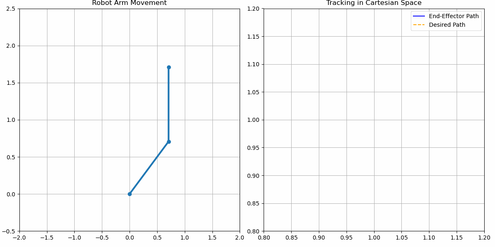
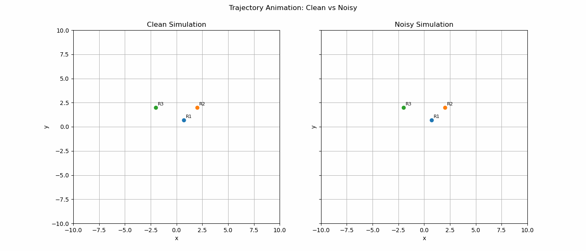

# A Comparative Analysis of Robot Control Methodologies

This repository contains a comprehensive study and implementation of several fundamental robot arm control algorithms. The project investigates not only different control strategies but also the impact of parameter tuning on performance, with "soft," "balanced," and "aggressive" profiles for both PID and Impedance controllers.

---

## 1. PID (Proportional-Integral-Derivative) Control

A closed-loop controller that minimizes the error between a desired setpoint and the robot's current state. The controller's performance was tuned to produce three distinct behaviors by adjusting the P, I, and D gains:
* **Soft**: Minimal overshoot, slow response.
* **Balanced**: Fast response with minimal overshoot.
* **Aggressive**: Very fast response, accepting some overshoot.

**Script**: `scripts/PID.py`


---

## 2. Impedance Control

An advanced control strategy that regulates the robot's mechanical impedance (stiffness and damping) rather than its position directly. This allows for safe and compliant interaction with the environment. The controller was tuned for three profiles:
* **Soft**: Low stiffness, highly compliant.
* **Balanced**: Medium stiffness and compliance.
* **Aggressive**: High stiffness, less compliant.

**Script**: `scripts/impedance.py`



---

## 3. Multi-Robot Formation Control

This controller implements a leader-follower strategy for a multi-agent system. Follower robots must maintain a precise geometric formation relative to a leader, demonstrating decentralized control principles.

**Script**: `scripts/formation.py`



---

## Tech Stack

* **Language**: Python
* **Core Libraries**: NumPy, Matplotlib

---

## Setup and Installation

1.  **Clone the repository:**
    ```bash
    git clone https://github.com/Derrick-M99/comparative-robot-control.git
    ```

2.  **Install dependencies:**
    *(You may need to install the simulation software first.)*
    ```bash
    pip install -r requirements.txt
    ```

---

## How to Run

Each script is designed to be run independently.

* **To run the PID control simulation:**
    ```bash
    python scripts/PID.py
    ```
* **To run the formation control simulation:**
    ```bash
    python scripts/formation.py
    ```

---

## License

This project is licensed under the **MIT License**.
